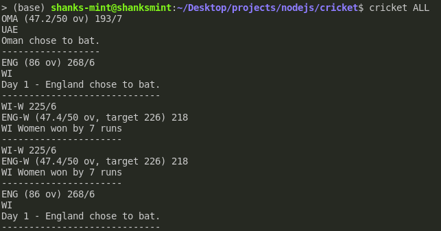

# Cricket Commentary for Programming Nerds
I am not exactly passionate about the game, but I do enjoy supporting my country and following the national team's journey. However, since I've quit Facebook and stopped watching TV, I have no way to tell when Bangladesh is having a cricket match. This one is an attempt to get myself back into cricket. It basically navigates into the _espncricinfo_ website and gets the updates, and reads them out for me using the _espeak_ voice synthesising package.
## Screenshots
